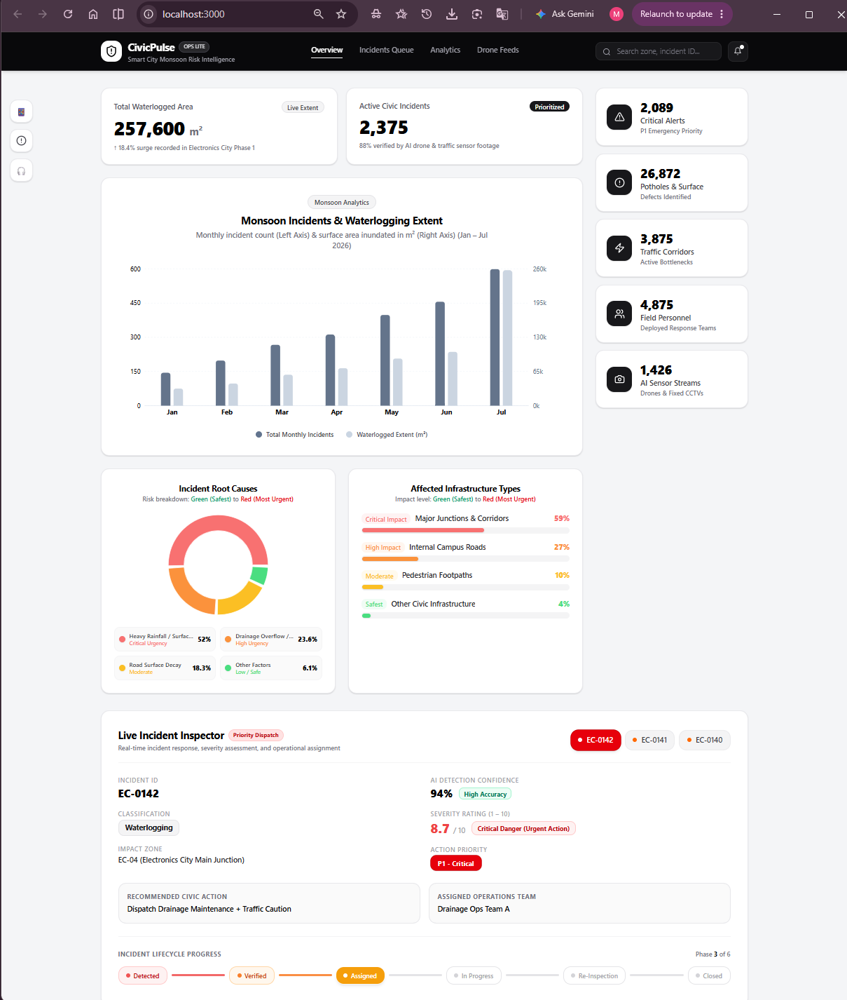

# CivicPulse

### AI-Assisted Monsoon Civic Risk Intelligence & Response System

> **ELCIA Smart City Drone-AI Challenge 2026**  
> **Track:** Monsoon, Roads & Civic Infrastructure Intelligence

CivicPulse is an **AI-assisted civic intelligence platform** designed to convert road and aerial video into **evidence-backed, prioritized infrastructure incidents**.

The flagship use case is **waterlogging detection and prioritization**, with **pothole detection** as a secondary capability and **drainage overflow** as a future extension.

---

## Core Product Story

**Detection → Evidence → Severity → Priority → Action → Verification → Closure**

CivicPulse is designed to move beyond simply detecting an infrastructure problem and instead support the complete civic response workflow.

---

# Problem

During monsoon events, civic teams face difficulty continuously monitoring road and drainage conditions, determining which issues are most severe, and deciding which intervention should happen first.

CivicPulse aims to provide a **visual intelligence layer** that transforms road and aerial video into structured civic incidents that can be reviewed, prioritized and tracked through a maintenance workflow.

The initial problem context is **Electronics City**, with the architecture designed to generalize to other urban environments.

---

# Target Use Case

## Primary — Waterlogging

Waterlogging is the **flagship capability** because it enables:

- **Affected-area estimation**
- **Temporal persistence analysis**
- **Road obstruction assessment**
- **Severity estimation**
- **Operational prioritization**
- **Evidence-backed alerts**

## Secondary — Potholes

Pothole detection extends the system toward **persistent road-surface maintenance**.

## Future — Drainage Overflow

Drainage overflow/blockage detection can be incorporated where the available video provides sufficient visual evidence.

---

# System Architecture

```text
                    INPUT
                      │
              Road / Drone Video
                      │
                      ▼
              ┌─────────────────┐
              │ Frame Sampling  │
              └────────┬────────┘
                       │
                       ▼
             ┌────────────────────┐
             │ AI Detection / Seg │
             │ Waterlogging       │
             │ Pothole            │
             └─────────┬──────────┘
                       │
                       ▼
             ┌────────────────────┐
             │ Temporal Association│
             │ Tracking / Dedup    │
             └─────────┬──────────┘
                       │
                       ▼
              ┌─────────────────┐
              │ Incident Engine │
              └────────┬────────┘
                       │
          ┌────────────┼────────────┐
          ▼            ▼            ▼
      Evidence      Severity     Context
          │            │            │
          └────────────┼────────────┘
                       ▼
               Priority Engine
                       │
                       ▼
                 FastAPI API
                       │
              ┌────────┴────────┐
              ▼                 ▼
        React Dashboard      Database
              │
              ▼
       Human Verification
              │
       ┌──────┼─────────┐
       ▼      ▼         ▼
    Reject  Assign   Modify
                       │
                       ▼
                 In Progress
                       │
                       ▼
                Re-inspection
                       │
                       ▼
                    Closed
```

---

# AI Pipeline

## 1. Video Ingestion

The system is designed to accept:

- Road-level video
- Elevated / aerial-style video
- Monsoon-condition footage
- Challenge-provided sample data
- Locally captured footage
- Permitted public datasets / videos

The system **does not assume precise GPS metadata** when it is unavailable.

---

## 2. Waterlogging Detection

Waterlogging is treated primarily as a **segmentation problem** to estimate:

- Affected water region
- Approximate road coverage
- Spatial extent
- Persistence across frames

This allows the system to reason about the **extent and impact of waterlogging**, rather than only detecting it with a bounding box.

---

## 3. Pothole Detection

Potholes are treated as an **object-detection problem** providing:

- Class
- Confidence
- Bounding region
- Timestamp
- Source / context

The final model architecture will be selected after inspecting the available dataset and camera viewpoints.

---

## 4. Temporal Intelligence

Repeated frame-level detections are aggregated into incidents to:

- Suppress duplicate alerts
- Estimate persistence duration
- Identify event start / end
- Generate representative evidence frames or clips

```text
Frame 1 ──┐
Frame 2 ──┤
Frame 3 ──┤──► ONE CIVIC INCIDENT
Frame 4 ──┤
Frame 5 ──┘
```

This allows the system to reason about an **event**, rather than treating every frame-level detection as a separate incident.

---

## 5. Severity & Priority

Severity considers:

- Water extent
- Persistence
- Road obstruction
- Road criticality

```text
Water Extent
      +
Persistence
      +
Road Obstruction
      +
Road Criticality
      ↓
Severity Score
```

Priority then combines **severity + operational context** to determine the recommended response level:

| Priority | Meaning |
|---|---|
| **P1 — Critical** | Immediate / high-impact intervention |
| **P2 — High** | High-priority inspection or maintenance |
| **P3 — Routine** | Normal maintenance queue |

The exact weights and thresholds will be calibrated using validation data.

---

## 6. Evidence Generation

Each incident is packaged with:

- Representative evidence frame
- Short video clip where available
- Timestamp
- Source / zone
- Model confidence
- Severity
- Priority
- Recommended action

This creates an **evidence-backed alert** rather than a detection-only output.

---

# Dashboard Snapshot




# Incident Intelligence

Each detected event is converted into a **structured civic incident**.

### Example Incident

```json
{
  "incident_id": "EC-001",
  "type": "waterlogging",
  "confidence": 0.94,
  "severity": 8.7,
  "priority": "P1",
  "timestamp": "00:02:14",
  "zone": "EC-04",
  "duration_seconds": 182,
  "evidence": "evidence/EC-001.jpg",
  "recommended_action": "drainage_inspection",
  "owner": "Drainage Operations",
  "status": "VERIFIED"
}
```

The schema is expected to evolve as the dataset and operational requirements are validated.

---

# Severity vs Priority

CivicPulse explicitly separates **confidence**, **severity**, and **priority**.

### Confidence

**How certain is the model that the event exists?**

### Severity

**How serious is the observed physical condition?**

### Priority

**How urgently should the civic team respond?**

A moderate waterlogging event at a major junction may deserve higher operational priority than severe waterlogging on a low-traffic internal road.

---

## Initial Severity Factors

```text
Water Extent
      +
Persistence
      +
Road Obstruction
      +
Road Criticality
      ↓
Severity Score
```

The exact weights and thresholds will be calibrated using validation data.

---

## Priority Levels

| Priority | Meaning |
|---|---|
| **P1 — Critical** | Immediate / high-impact intervention |
| **P2 — High** | High-priority inspection or maintenance |
| **P3 — Routine** | Normal maintenance queue |

---

# Evidence-Backed Alerts

Every important incident should contain enough information for an operator to verify it.

### Expected Incident Information

- **Event class**
- **Model confidence**
- **Severity**
- **Priority**
- **Timestamp**
- **Source / zone**
- **Evidence frame**
- **Short video clip**
- **Persistence**
- **Recommended action**
- **Owner**
- **Workflow status**

The goal is to move beyond:

> **"Waterlogging detected."**

toward:

> **"Waterlogging detected here, at this time, with this evidence, at this severity, with this operational priority and this recommended response."**

---

# Operator Workflow

```text
DETECTED
   │
   ▼
VERIFIED
   │
   ▼
ASSIGNED
   │
   ▼
IN PROGRESS
   │
   ▼
RE-INSPECTION
   │
   ▼
CLOSED
```

The system is intended to create a **closed loop from visual detection to verified resolution**.

---

# Dashboard

The planned dashboard will provide a lightweight **civic operations interface**.

### Dashboard Features

- **Incident map**
- **Active incident queue**
- **Priority counts**
- **Recent detections**
- **Zone filters**
- **Incident-type filters**
- **Status filters**
- **Visual evidence**
- **Severity**
- **Priority**
- **Recommended action**
- **Assigned owner**
- **Workflow status**

### Representative Incident Card

```text
┌─────────────────────────────────┐
│ WATERLOGGING                    │
│                                 │
│ Severity: 8.7 / 10              │
│ Priority: P1                    │
│ Confidence: 94%                 │
│ Zone: EC-04                     │
│                                 │
│ [ Evidence Frame / Short Clip ] │
│                                 │
│ Recommended Action:             │
│ Drainage Inspection             │
│                                 │
│ Owner: Drainage Operations      │
│ Status: ASSIGNED                │
└─────────────────────────────────┘
```

The dashboard is designed to provide **maximum operational information with minimal interface complexity**.

---

# Human-in-the-Loop

CivicPulse is an **AI-assisted decision-support system**, not an autonomous civic authority.

### AI provides

- Detection
- Evidence
- Confidence
- Severity estimate
- Priority recommendation
- Suggested action

### Operators retain control over

- Incident verification
- Priority modification
- Ownership
- Status
- Rejection
- Closure

Low-confidence or high-impact incidents can require **explicit human verification** before assignment.

---

# Testing & Validation

The system will be evaluated at both the **model level** and the **incident/workflow level**.

## Test Conditions

Testing will cover:

- Heavy rain
- Wet-road reflections
- Low-light conditions
- Partial occlusion
- Vehicle obstruction
- Low-contrast waterlogging
- Partially submerged potholes
- Varying camera viewpoints

---

## Model Metrics

Potential model-level metrics include:

- **Precision**
- **Recall**
- **F1 Score**
- **mAP**
- **Segmentation metrics**, where applicable

---

## Incident-Level Metrics

The system will additionally measure:

- **Incident-level recall**
- **False alerts per hour**
- **Missed incidents**
- **Duplicate-incident rate**
- **Detection-to-alert latency**
- **Evidence completeness**

### False Positive Example

```text
Wet-road reflection
        ↓
False waterlogging detection
```

### False Negative Example

```text
Vehicle blocks flooded region
        ↓
Waterlogging missed
```

Special attention will be given to these failure cases during validation.

---

# Technology Stack

| Layer | Proposed Technology |
|---|---|
| **Computer Vision** | Lightweight detection / segmentation model |
| **Tracking** | ByteTrack / BoT-SORT or equivalent |
| **Backend** | FastAPI |
| **Database** | PostgreSQL / PostGIS |
| **Dashboard** | React |
| **Mapping** | Leaflet / MapLibre |
| **Language** | Python |
| **Evaluation** | Python |
| **Deployment** | Local GPU → Edge-ready optimization |

> **Note:** Final model and framework choices will be validated after dataset inspection and baseline evaluation.

---

# Deployment & Compute Strategy

The prototype will prioritize **lightweight local inference** and avoid unnecessary cloud dependency.

### Development

- Local GPU workstation for training / inference
- Python-based ML pipeline
- Optional cloud GPU / Colab for training experiments where required

### Future Deployment Direction

```text
Camera / Drone
      │
      ▼
Edge Inference
      │
      ▼
Event Metadata + Evidence
      │
      ▼
Central Dashboard
```

The architecture is designed with **future edge deployment** in mind.

---

# Reproducibility

The eventual repository will provide:

- Installation instructions
- Dependency specification
- Model configuration
- Sample input
- Inference instructions
- Evaluation scripts
- Example outputs
- Architecture documentation

### Target End-to-End Usage

```bash
python run.py --input sample.mp4
```

### Expected Outputs

```text
outputs/
├── annotated_video.mp4
├── incidents.json
└── evidence/
    ├── EC-001.jpg
    └── EC-002.jpg
```

---

# Project Status

> **Proposal / Pre-Build Stage**

### Current Focus

- [x] Problem definition
- [x] System architecture
- [x] AI pipeline design
- [x] Severity / priority framework
- [x] Evaluation strategy
- [x] Implementation planning

### Planned Next Stages

- [ ] Dataset reconnaissance
- [ ] Data preprocessing
- [ ] Waterlogging baseline
- [ ] Pothole baseline
- [ ] Temporal association
- [ ] Incident generation
- [ ] Severity scoring
- [ ] Priority engine
- [ ] Evidence generation
- [ ] Dashboard
- [ ] Backend API
- [ ] Evaluation
- [ ] End-to-end demo
- [ ] Edge optimization

---

# Roadmap

### Phase 1 — Dataset & Baseline

Understand available videos, labels, viewpoints and data quality.

### Phase 2 — Detection

Build the initial waterlogging and pothole detection models.

### Phase 3 — Temporal Intelligence

Convert frame-level detections into persistent incidents.

### Phase 4 — Civic Intelligence

Add severity, priority, evidence and contextual reasoning.

### Phase 5 — Operations

Build the dashboard, assignment and closure workflow.

### Phase 6 — Validation

Evaluate the system on unseen clips and challenging environmental conditions.

### Phase 7 — Demonstration

Package the complete pipeline into a reproducible, demonstration-ready prototype.

---

# Risks & Limitations

## Rain & Reflections

Wet surfaces can resemble waterlogged regions.

**Mitigation:** temporal persistence, contextual logic and confidence thresholds.

---

## Occlusion

Vehicles and pedestrians may hide affected regions.

**Mitigation:** multi-frame association and evidence review.

---

## Geolocation

Sample videos may lack precise GPS metadata.

**Mitigation:** use source / zone identifiers rather than fabricating coordinates.

---

## Domain Shift

Performance may vary across:

- Camera height
- Weather
- Lighting
- Road design
- Viewpoint

**Mitigation:** validate on unseen viewpoints and maintain a retraining / fine-tuning workflow.

---

## AI Uncertainty

Model confidence does not automatically represent civic severity.

**Mitigation:** explicitly separate **confidence, severity and operational priority**.

---

# Project Principles

### 1. Detect Early

Identify visible infrastructure risks before they become larger operational problems.

### 2. Prove With Evidence

Important alerts should contain visual and contextual evidence.

### 3. Prioritize Intelligently

Severity alone should not determine operational priority.

### 4. Keep Humans in the Loop

AI assists civic teams; it does not replace operational judgment.

### 5. Close the Loop

Support assignment, action, re-inspection and closure.

---

# Core Product Story

## OBSERVE → UNDERSTAND → PRIORITIZE → ACT → VERIFY

> **CivicPulse transforms visual observations into actionable civic intelligence.**

---

# ELCIA Smart City Drone-AI Challenge

**Challenge:** ELCIA Smart City Drone-AI Challenge 2026  
**Selected Track:** Monsoon, Roads & Civic Infrastructure Intelligence  
**Context:** Electronics City

This project is currently at the **proposal / pre-build stage** and is intended to evolve into a working prototype during the build phase.

---

## License

This project is being developed as part of the **ELCIA Smart City Drone-AI Challenge 2026**.

License and usage terms will be finalized as the project progresses.