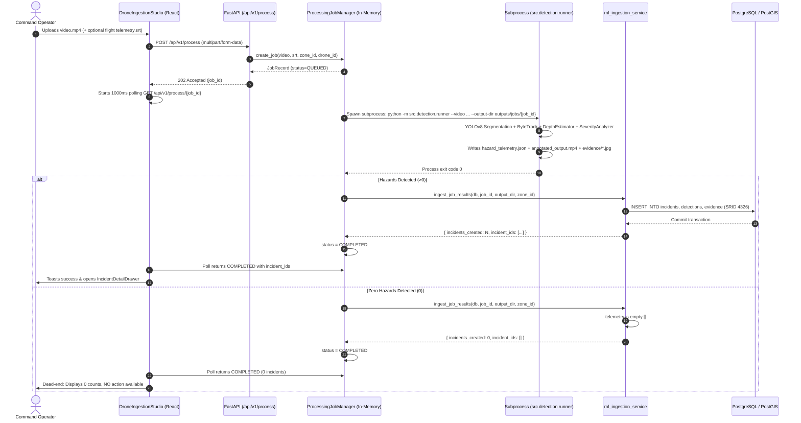

# CivicPulse — Architecture Audit: No-Incident Human Verification Workflow

**Date:** September 6, 2026  
**Document Version:** 1.0.0  
**Status:** Architecture Design & Feasibility Audit (Pre-Implementation)  
**Target Module:** Drone Ingestion Studio, ML Processing Lifecycle, Verification Workflow & Incident Relational Data Model

---

## 1. Executive Summary & Problem Context

CivicPulse currently automates the detection, spatial mapping, and database ingestion of 5 core monsoon municipal hazards (**waterlogging, potholes, drainage overflow, damaged footpaths, and open manholes**) from aerial drone video clips and DJI SRT telemetry.

When the ML pipeline detects one or more hazards:
1. It generates frame evidence snapshots and a `hazard_telemetry.json` payload.
2. `ml_ingestion_service.py` idempotently creates linked `incidents`, `detections`, and `evidence` records in PostgreSQL/PostGIS.
3. The frontend displays the newly created incidents and navigates the operator to the Incident Detail Drawer for triage, verification, and dispatch.

**However, when the ML pipeline completes successfully and detects ZERO hazards:**
- The ML engine outputs `hazard_telemetry.json` containing an empty list `[]` and 0 evidence snapshots.
- `ml_ingestion_service.py` creates 0 database records.
- The frontend `DroneIngestionStudio` displays static zero counters (`Waterlogging: 0, Potholes: 0, ...`) and plays the annotated video, but presents **no interactive verification flow**.
- There is **no persistent record** in the database that the video was processed or reviewed by an operator.
- If the AI missed an obvious hazard (False Negative), the operator has **no direct mechanism** within the ingestion flow to dispute the AI result and register a manual incident.
- If the AI correctly found no hazard (True Negative), there is **no audit trail** proving that municipal surveillance occurred and was certified clear by an authorized operator.

This document presents a comprehensive architectural audit of the existing system and proposes a robust, relational, human-in-the-loop verification design.

---

## 2. Current Architecture & End-to-End Workflow Analysis

### 2.1 Video Ingestion & Processing Lifecycle



---

## 3. Deep Dive: Existing System Entities & Relationships

### 3.1 Backend Models & Schemas

| Entity / Model | Table Name | Key Attributes | Primary Function / Scope |
|---|---|---|---|
| **`Zone`** | `zones` | `id`, `code`, `name`, `geometry` (Polygon 4326) | Operational surveillance sectors (`EC-01` to `EC-04`). |
| **`User`** | `users` | `id`, `email`, `name`, `role` (`ADMIN`, `OPERATOR`, `INSPECTOR`) | Authenticated municipal system actors. |
| **`Incident`** | `incidents` | `id`, `incident_code`, `incident_type`, `confidence`, `severity_score`, `priority`, `status`, `zone_id`, `location` (Point 4326) | Central civic risk event record. |
| **`Detection`** | `detections` | `id`, `incident_id` (FK NOT NULL), `detection_type`, `confidence`, `frame_number`, `detection_metadata` | Frame-level bounding box & mask observations. |
| **`Evidence`** | `evidence` | `id`, `incident_id` (FK NOT NULL), `evidence_type`, `file_path`, `is_primary` | Media assets (snapshots, video clips). |
| **`Assignment`** | `assignments` | `id`, `incident_id` (FK NOT NULL), `assigned_to` (FK), `assigned_team` | Maintenance crew dispatch assignments. |
| **`IncidentStatusHistory`** | `incident_status_history` | `id`, `incident_id` (FK NOT NULL), `old_status`, `new_status`, `changed_by` (FK), `comment` | Chronological state transition audit log. |
| **`Inspection`** | `inspections` | `id`, `incident_id` (FK NOT NULL), `inspector_id` (FK), `result` (`RESOLVED`, `NOT_RESOLVED`, `PARTIALLY_RESOLVED`), `notes`, `location` | Post-repair field inspection and resolution log. |

### 3.2 State Models & Enums

1. **`JobStatus`** (`src/schemas/processing.py`):
   - `QUEUED`: Job is waiting in asynchronous queue.
   - `PROCESSING`: Subprocess is currently running inference on GPU/CPU.
   - `COMPLETED`: ML finished and database ingestion step executed.
   - `FAILED`: Subprocess exited with non-zero returncode or ingestion exception.

2. **`IncidentStatus`** (`src/db/models/enums.py`):
   - `DETECTED` (Initial state upon AI ingestion)
   - `VERIFIED` (Operator confirmed genuine incident)
   - `ASSIGNED` (Dispatched to field response team)
   - `IN_PROGRESS` (Field repairs underway)
   - `RE_INSPECTION` (Field work logged, pending re-check)
   - `CLOSED` (Incident resolved and verified)
   - `REJECTED` (Marked as false positive by operator)

3. **`InspectionResult`** (`src/db/models/enums.py`):
   - `RESOLVED` (Hazard completely cleared and verified on site)
   - `PARTIALLY_RESOLVED` (Interim patch applied, follow-up required)
   - `NOT_RESOLVED` (Hazard remains active, re-dispatch needed)

---

## 4. Current Gaps & Technical Shortcomings

### Gap 1: In-Memory Job Volatility
- `ProcessingJobManager` stores active jobs in an in-memory dictionary (`self.jobs: Dict[str, JobRecord]`).
- When the backend application restarts (e.g., deployment, server reboot, crash), all historical job records are wiped from memory.
- If a video flight produced 0 incidents, there is no trace of that flight anywhere in PostgreSQL.

### Gap 2: Relational Foreign Key Constraint on `inspections`
- The existing `inspections` table requires `incident_id` (`nullable=False, ForeignKey("incidents.id")`).
- An inspection cannot be logged for a zero-incident flight without either:
  1. Creating a synthetic/dummy incident (violates relational integrity and pollutes analytics), OR
  2. Altering the `inspections` table schema, OR
  3. Creating a dedicated `flight_reviews` / `video_verifications` entity.

### Gap 3: Domain Misalignment of `InspectionResult`
- `InspectionResult` contains `RESOLVED`, `NOT_RESOLVED`, `PARTIALLY_RESOLVED`.
- These values represent **physical repair outcomes in the field**, not **AI aerial footage verification** (`CONFIRMED_CLEAR`, `ANOMALY_FOUND`, `FALSE_NEGATIVE`).

### Gap 4: Frontend Dead-End on Zero Incidents
- In `DroneIngestionStudio.tsx` (lines 246–256):
  ```typescript
  const incidentsCreated = statusRes.results?.summary?.incidents_created ?? 0;
  toast.success(`Real ML Pipeline & Ingestion Complete!`, {
    description: `Detected hazards automatically ingested into PostgreSQL/PostGIS (${incidentsCreated} incidents created).`,
  });
  if (statusRes.results?.incident_ids?.length) {
    onIncidentPublished(statusRes.results.incident_ids[0]);
  }
  ```
- If `incidentsCreated === 0`, nothing is opened, no review prompt appears, and the user is left with a passive video player.

### Gap 5: Missing Manual Incident Creation Bridge
- When an operator watches the zero-incident video and observes an un-detected hazard (e.g. obscured pothole, boundary waterlogging), there is no streamlined UI to capture a video frame or GPS location and publish a manual incident directly from the studio.

---

## 5. Required Business Workflow Specification

```
                          ┌──────────────────────────┐
                          │   Upload Drone Video     │
                          │   (+ optional SRT)       │
                          └─────────────┬────────────┘
                                        │
                                        ▼
                          ┌──────────────────────────┐
                          │   AI Pipeline Runner     │
                          │   (YOLOv8 + MiDaS + SRT) │
                          └─────────────┬────────────┘
                                        │
                         Did AI create any incidents?
                                        │
                     ┌──────────────────┴──────────────────┐
                     │                                     │
                  YES (>0)                              NO (0)
                     │                                     │
                     ▼                                     ▼
        ┌─────────────────────────┐           ┌─────────────────────────┐
        │ Existing Incident Flow: │           │ "No Anomalies Detected" │
        │ DETECTED -> VERIFIED    │           │ Human Verification Card │
        │ -> ASSIGNED -> CLOSED   │           └────────────┬────────────┘
        └─────────────────────────┘                        │
                                                           ▼
                                            Operator Reviews Video Playback
                                                           │
                                        ┌──────────────────┴──────────────────┐
                                        │                                     │
                                   Human Confirms:                       Human Disputes:
                                   "No Anomaly"                          "Anomaly Exists"
                                        │                                     │
                                        ▼                                     ▼
                          ┌───────────────────────────┐         ┌───────────────────────────┐
                          │ 1. Log Verified Clean     │         │ 1. Open Manual Incident   │
                          │    Audit Record in DB     │         │    Creation Dialog        │
                          │ 2. Status: CONFIRMED_CLEAR│         │ 2. Select Hazard Type,    │
                          │ 3. Close & Archive Review │         │    Zone, Severity, Time   │
                          └───────────────────────────┘         │ 3. Insert Incident in DB  │
                                                                │    (Status: DETECTED)     │
                                                                │ 4. Link Video Evidence    │
                                                                │ 5. Open in Queue/Drawer   │
                                                                └───────────────────────────┘
```

---

## 6. Proposed Architecture & Implementation Strategy

### 6.1 Database Architecture Options Evaluated

#### Option A: Dedicated `video_reviews` (or `flight_verifications`) Table *(RECOMMENDED)*
Create a distinct, first-class relational entity to record video processing audits and human verifications.

```sql
CREATE TABLE video_verifications (
    id UUID PRIMARY KEY DEFAULT gen_random_uuid(),
    job_id VARCHAR(64) NOT NULL UNIQUE,
    video_filename VARCHAR(255) NOT NULL,
    video_path VARCHAR(512) NOT NULL,
    annotated_video_url VARCHAR(512),
    telemetry_path VARCHAR(512),
    zone_id UUID REFERENCES zones(id) ON DELETE RESTRICT,
    drone_id VARCHAR(64),
    ai_hazard_count INTEGER NOT NULL DEFAULT 0,
    verification_status VARCHAR(32) NOT NULL DEFAULT 'PENDING_REVIEW', -- PENDING_REVIEW, CONFIRMED_CLEAR, ANOMALY_REPORTED
    reviewer_id UUID REFERENCES users(id) ON DELETE SET NULL,
    reviewed_at TIMESTAMP WITH TIME ZONE,
    review_notes TEXT,
    created_incident_id UUID REFERENCES incidents(id) ON DELETE SET NULL,
    created_at TIMESTAMP WITH TIME ZONE NOT NULL DEFAULT NOW(),
    updated_at TIMESTAMP WITH TIME ZONE NOT NULL DEFAULT NOW()
);
```

**Pros:**
- **Zero Schema Pollution**: Does not modify existing `incidents` or `inspections` tables.
- **Persistent History**: Keeps a complete permanent log of all aerial surveillance missions, even when no hazards were found.
- **Clean Relational Linkage**: If an anomaly is reported, `created_incident_id` links directly to the newly registered incident.
- **Analytics Ready**: Enables calculating AI True Negative / False Negative rates and mission coverage metrics.

**Cons:**
- Requires a new Alembic migration (`20260907_004_add_video_verifications.py`).

---

#### Option B: Alter Existing `inspections` Table (Make `incident_id` Nullable)
Modify `inspections.incident_id` to be nullable and add new enum values to `InspectionResult`.

**Why NOT Recommended:**
- Conflates two completely different operational domains:
  - Domain 1: **Drone Video Ingestion & AI QA Verification** (performed by Command Center Operators).
  - Domain 2: **Physical On-Site Field Work Order Verification** (performed by Field Inspectors after civil maintenance).
- Weakens relational constraints (`incident_id` cannot be foreign-key enforced if nullable).

---

### 6.2 Proposed API Endpoints

1. `GET /api/v1/verifications`
   - List pending and completed video flight verifications with status filters (`PENDING_REVIEW`, `CONFIRMED_CLEAR`, `ANOMALY_REPORTED`).
2. `GET /api/v1/verifications/{job_id_or_id}`
   - Retrieve flight verification details, AI summary, and video playback URLs.
3. `POST /api/v1/verifications/{id}/confirm-clear`
   - Operator confirms AI result: logs `CONFIRMED_CLEAR`, timestamps review, and records reviewer identity.
4. `POST /api/v1/verifications/{id}/report-anomaly`
   - Operator rejects AI result: creates a new `Incident`, attaches the video flight evidence, updates verification status to `ANOMALY_REPORTED`, and returns the created `IncidentResponse`.

---

### 6.3 Proposed Frontend User Interface Architecture

1. **`DroneIngestionStudio.tsx` Enhancement**:
   - When real ML processing returns `incidents_created === 0`, display a prominent, styled **"No Anomalies Detected by AI" Human Verification Card**:
     - Visual badge: `AI Audit: Clean Surface Verified` (Emerald / Slate).
     - Embedded player displaying the annotated processed flight video.
     - Telemetry & flight path metadata summary.
     - Two primary action buttons:
       - **Button 1 (Green / Outline)**: `[✓ Confirm No Anomaly]` -> Submits confirmation, logs audit to DB, toasts "Flight certified clear".
       - **Button 2 (Amber / Solid)**: `[! Report Undetected Hazard]` -> Opens interactive modal to select hazard type, timestamp, coordinates, and create a genuine incident.
2. **`ManualAnomalyModal.tsx` (New Component)**:
   - Form fields: Hazard Type (`waterlogging`, `pothole`, `drainage_overflow`, `damaged_footpath`, `open_manhole`), Priority (`P1`, `P2`, `P3`), Severity Estimate (1–10), Description/Notes, Video Frame Timestamp.
   - On submit: Calls `POST /api/v1/verifications/{id}/report-anomaly`, closes modal, refreshes incident queue, and immediately opens the new incident in the `IncidentDetailDrawer`.
3. **Flight Verifications Tab / Filter (Optional Future Phase)**:
   - Add a "Surveillance Flights" view in the navbar to audit all drone flights regardless of hazard detection status.

---

## 7. Impact Analysis & Exact Files Likely to Change

### 7.1 Backend Changes
| File Path | Nature of Change | Description |
|---|---|---|
| `src/db/models/verification.py` | **[NEW]** | `VideoVerification` ORM model. |
| `src/db/models/__init__.py` | **[MODIFY]** | Export `VideoVerification` model for Alembic discovery. |
| `src/db/models/enums.py` | **[MODIFY]** | Add `VerificationStatus` enum (`PENDING_REVIEW`, `CONFIRMED_CLEAR`, `ANOMALY_REPORTED`). |
| `src/schemas/verification.py` | **[NEW]** | Pydantic schemas for verification requests and responses. |
| `src/repositories/verifications.py` | **[NEW]** | CRUD repository for video verifications. |
| `src/services/ml_ingestion_service.py` | **[MODIFY]** | Always insert a `VideoVerification` record upon job completion (linking created incidents or marking 0 hazards). |
| `src/api/routes/verifications.py` | **[NEW]** | API router endpoints for confirm-clear and report-anomaly workflows. |
| `src/api/routes/__init__.py` | **[MODIFY]** | Register `verifications` router. |
| `alembic/versions/20260907_004_add_video_verifications.py` | **[NEW]** | Migration creating `video_verifications` table. |

### 7.2 Frontend Changes
| File Path | Nature of Change | Description |
|---|---|---|
| `dashboard/client/src/types/verification.ts` | **[NEW]** | TypeScript interfaces for `VideoVerification` and review payloads. |
| `dashboard/client/src/services/verificationService.ts` | **[NEW]** | API client for verification endpoints. |
| `dashboard/client/src/components/ingestion/DroneIngestionStudio.tsx` | **[MODIFY]** | Add Zero-Incident Verification Card, confirmation handlers, and anomaly modal trigger. |
| `dashboard/client/src/components/ingestion/ManualAnomalyModal.tsx` | **[NEW]** | Dialog to register manual incidents when operator disputes AI negative result. |

---

## 8. Database Migration Requirement

> [!IMPORTANT]
> **A database migration is REQUIRED for the proposed architecture.**

- **Migration ID:** `20260907_004_add_video_verifications`
- **Reversibility:** Fully reversible via standard `downgrade()` (`op.drop_table("video_verifications")`).
- **Data Safety:** Zero impact on existing `incidents`, `zones`, `users`, `detections`, or `evidence` records.

---

## 9. Risks, Edge Cases & Mitigation Strategies

| Risk / Edge Case | Impact | Mitigation Strategy |
|---|---|---|
| **Server restart while review is pending** | In-memory `job_manager` loses state. | By persisting the `VideoVerification` row in PostgreSQL immediately upon ML completion, pending reviews survive server restarts. |
| **Operator reports anomaly with missing GPS** | Incident created without exact geographic coordinates. | Default to the flight's operational zone centroid or flight start GPS coordinates. |
| **Large video file retention for clean flights** | Disk storage growth on repeated clean flights. | Retain metadata and telemetry JSON in PostgreSQL; configure optional automated cleanup policy for raw `.mp4` video files older than 30 days if verified clean. |
| **Analytics skew from negative missions** | Clean flights skewing incident backlog metrics. | Keep `video_verifications` strictly separated from `incidents` table. Analytics queries on `incidents` remain 100% unaffected. |

---

## 10. Conclusion & Next Steps

This audit establishes that the cleanest, most scalable architecture for the No-Incident Human Verification workflow is to introduce a dedicated `video_verifications` entity in PostgreSQL. This preserves all existing incident, inspection, and dispatch workflows while providing a seamless, audit-compliant UI for command operators.

Implementation should proceed only after review and sign-off on this architectural blueprint.
