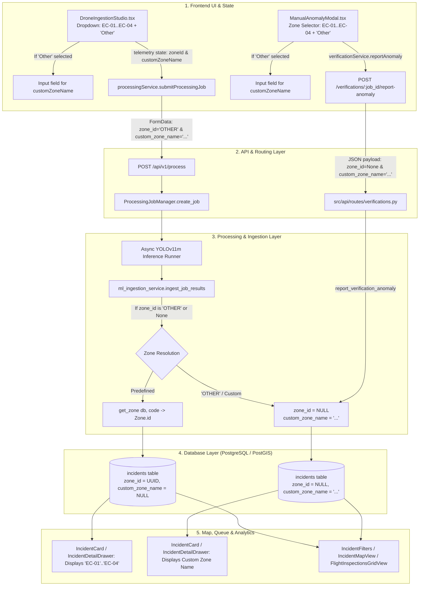

# CivicPulse — Operational Zone & Telemetry Flow Audit: "Other" Custom Zone Option
**Document ID:** `docs/OPERATIONAL_ZONE_OTHER_AUDIT.md`  
**Status:** AUDIT ONLY (Implementation Pending Approval)  
**Author:** Antigravity AI Engineering  
**Date:** September 7, 2026  

---

## Executive Summary

This audit assesses adding an **"Other" (Custom Zone)** option alongside the four existing predefined operational surveillance zones (`EC-01`, `EC-02`, `EC-03`, `EC-04`).

### Key Audit Conclusions
1. **No Fake "Other" Polygon in Database**: `EC-01` through `EC-04` remain the authoritative geographic zones in PostgreSQL/PostGIS. "Other" will **not** be inserted as a dummy zone row in the `zones` table.
2. **Database Schema Requirement**: In `src/db/models/incident.py`, `Incident.zone_id` is currently **`nullable=False`** (with a `NOT NULL` SQL constraint). To support custom zones safely without assigning a fake zone, an Alembic migration is required to make `incidents.zone_id` **`nullable=True`** and add a dedicated **`custom_zone_name` (VARCHAR 128, nullable=True)** column.
3. **No Field Overloading**: Existing fields like `recommended_action` store municipal repair templates (e.g. *"Apply cold mix asphalt..."*), and `location` stores PostGIS Point geometry `(lng, lat)`. An explicit `custom_zone_name` field is the cleanest, safest design.
4. **ML & Detection Pipeline Integrity**: The YOLOv11m / MiDaS ML inference engine (`src/detection/runner.py`) is decoupled from zones and will not require modification.
5. **SRT Auto-Detection Harmony**: When drone telemetry falls outside `EC-01`–`EC-04`, the backend `/zones/detect` endpoint already returns `status: "NO_MATCH"`. In this case, the UI can automatically switch the dropdown to `"Other"` and invite the operator to input the custom area name.

---

## 1. Trace: End-to-End Zone Selection Flow



---

## 2. Detailed Technical Audit (Layers 1 – 7)

### Layer 1: Frontend Zone Dropdowns & Components
* **`DroneIngestionStudio.tsx` (Lines 680–699)**:
  * Current: Fixed `<Select>` with `EC-01`, `EC-02`, `EC-03`, `EC-04`.
  * Required change: Add `<SelectItem value="OTHER">Other (Custom Zone)</SelectItem>`. When selected, render an animated `<Input>` field for `customZoneName`.
* **`ManualAnomalyModal.tsx` (Lines 287–297)**:
  * Current: Fixed `<select>` with 4 hardcoded `<option>` elements.
  * Required change: Add `<option value="OTHER">Other (Custom Zone)</option>` and a conditional custom zone input.
* **`IncidentFilters.tsx` (Lines 259–272)**:
  * Filter dropdown has `All Zones`, `EC-01`–`EC-04`.
  * Required change: Add `<SelectItem value="OTHER">Other / Custom Zones</SelectItem>`.
* **`IncidentMapView.tsx` (Lines 242–248)**:
  * Sliding filter segmented control has `[All Zones, EC-01, EC-02, EC-03, EC-04]`.
  * Required change: Add `{ id: 'OTHER', label: 'Other / Custom', badge: ... }`.
* **`FlightInspectionsGridView.tsx` (Lines 140–157)**:
  * Filter dropdown has `All Zones`, `EC-01`–`EC-04`.
  * Required change: Add `<SelectItem value="OTHER">Other / Custom Zones</SelectItem>`.

### Layer 2: Form & State Handling
* **`DroneTelemetry` (`types/ingestion.ts`)**:
  * `zoneId: ZoneId;` $\rightarrow$ Change `ZoneId` type definition in `types/incident.ts` from `'EC-01' | 'EC-02' | 'EC-03' | 'EC-04'` to `'EC-01' | 'EC-02' | 'EC-03' | 'EC-04' | 'OTHER'`.
  * Add `customZoneName?: string;` to `DroneTelemetry`.
* **SRT Auto-Detection Interplay (`DroneIngestionStudio.tsx`)**:
  * When `processingService.detectZoneFromSrt(file)` returns `status: 'NO_MATCH'`, the UI currently displays a warning toast.
  * With this enhancement, `status: 'NO_MATCH'` can automatically set `telemetry.zoneId = 'OTHER'`, providing a smooth user experience when scanning outside predefined corridors.

### Layer 3: API Request Payloads
* **`processingService.submitProcessingJob`**:
  * Currently sends `formData.append('zone_id', zoneId)`.
  * If `zoneId === 'OTHER'`, sends `formData.append('zone_id', 'OTHER')` and `formData.append('custom_zone_name', customZoneName)`.
* **`verificationService.reportAnomaly`**:
  * Payload sends `{ zone_id: selectedZone === 'OTHER' ? null : selectedZone, custom_zone_name: customZoneName, ... }`.
* **Direct Incident Creation (`POST /api/v1/incidents/`)**:
  * Payload sends `{ zone_id: null, custom_zone_name: "..." }`.

### Layer 4: FastAPI Request Schemas & Models
* **`src/schemas/processing.py`**:
  * `create_processing_job` endpoint parameter: Add `custom_zone_name: Optional[str] = Form(None)`.
  * `FlightInspectionRunSummary`: Add `custom_zone_name: Optional[str] = None`.
* **`src/schemas/incident.py`**:
  * `IncidentBase`:
    * Current: `zone_id: UUID` *(mandatory!)*
    * Required: `zone_id: Optional[UUID] = None`, `custom_zone_name: Optional[str] = None`.
  * `IncidentResponse`:
    * `zone_id: Optional[UUID] = None`, `zone_code: Optional[str] = None`, `zone_name: Optional[str] = None`, `custom_zone_name: Optional[str] = None`.
* **`src/schemas/verification.py`**:
  * `ReportAnomalyRequest`:
    * Current: `zone_id: Optional[Union[UUID, str]] = None`.
    * Add: `custom_zone_name: Optional[str] = None`.

### Layer 5: Backend Service & Repository Handling
* **`src/services/processing_job_manager.py`**:
  * `JobRecord`: Store `custom_zone_name: Optional[str] = None`.
  * Pass `custom_zone_name` to `ingest_job_results`.
* **`src/services/ml_ingestion_service.py` (`ingest_job_results`)**:
  * **Current Behavior (Deficiency)**:
    ```python
    # Lines 101-115 currently FORCE fallback to EC-01 if zone is not in DB:
    if not zone:
        zone = get_zone(db, "EC-01")  # <-- FORCED FALLBACK
    ```
  * **Required Change**: If `zone_id == "OTHER"` or `zone_id is None`:
    Do **not** force-fallback to `EC-01`. Set `incident.zone_id = None` and `incident.custom_zone_name = custom_zone_name`.
* **`src/repositories/verifications.py` (`report_verification_anomaly`)**:
  * **Current Behavior (Deficiency)**:
    ```python
    # Lines 193-200 force-fallback to all_zones[0]
    ```
  * **Required Change**: If `zone_id is None` or `'OTHER'`, set `incident.zone_id = None` and `incident.custom_zone_name = custom_zone_name`.
* **`src/repositories/incidents.py`**:
  * `create_incident`: Support `zone_id: Optional[Union[uuid.UUID, str]] = None`, `custom_zone_name: Optional[str] = None`.
  * `_resolve_zone_filter`:
    * If `zone_id == "OTHER"`, filter by `Incident.zone_id.is_(None)`.

### Layer 6: Database Models & Foreign Keys
* **`src/db/models/zone.py` (`zones` table)**:
  * **Zero Changes Needed**. Remains clean with `EC-01`..`EC-04`.
* **`src/db/models/incident.py` (`incidents` table)**:
  * `zone_id`: Change `nullable=False` $\rightarrow$ `nullable=True`.
  * Add `custom_zone_name`: `Mapped[Optional[str]] = mapped_column(String(128), nullable=True)`.
  * Computed properties:
    ```python
    @property
    def zone_code(self) -> Optional[str]:
        if self.zone:
            return self.zone.code
        return "OTHER" if self.custom_zone_name else None

    @property
    def zone_name(self) -> Optional[str]:
        if self.zone:
            return self.zone.name
        return self.custom_zone_name or "Unassigned Zone"
    ```
* **`src/db/models/verification.py` (`video_verifications` table)**:
  * `zone_id` is **already `nullable=True`**.
  * Add optional `custom_zone_name: Mapped[Optional[str]] = mapped_column(String(128), nullable=True)`.

### Layer 7: Validation, Analytics, Map & PostGIS Impact
* **PostGIS & Geographic Coordinates**:
  * No impact on PostGIS Point geometries (`location` column). PostGIS stores `POINT(lng, lat)` regardless of whether `zone_id` is linked to a polygon.
* **Google Maps (`IncidentMapView.tsx`)**:
  * Markers plot directly via `incident.coordinates.lat/lng`.
  * Under `"All Zones"`, all markers (including custom zone incidents) render with zero issues.
  * Adding an `"Other"` filter tab allows filtering specifically for custom zone incidents.
* **Analytics (`src/repositories/analytics.py` / `AnalyticsDashboard.tsx`)**:
  * Overall KPIs (`total_active_incidents`, `p1_count`, `trends`, etc.) query `Incident` directly and will **fully include** all custom zone incidents.
  * `get_analytics_zones` (Bar chart "Incident Priority by Zone") groups by `Zone.code`. Custom zone incidents (`zone_id IS NULL`) will not attach to `EC-01`–`EC-04`. If desired, an extra row `{"zone_code": "OTHER", "zone_name": "Other / Custom Zones", ...}` can be appended.

---

## 3. Answers to Required Audit Questions

### 1. Files Involved
#### Backend
* [src/db/models/incident.py](file:///d:/Not-So-Smart_ELCIA/src/db/models/incident.py) — Make `zone_id` nullable, add `custom_zone_name`.
* [src/db/models/verification.py](file:///d:/Not-So-Smart_ELCIA/src/db/models/verification.py) — Add `custom_zone_name`.
* [alembic/versions/20260907_005_nullable_zone_and_custom_name.py](file:///d:/Not-So-Smart_ELCIA/alembic/versions) — Database migration.
* [src/schemas/incident.py](file:///d:/Not-So-Smart_ELCIA/src/schemas/incident.py) — `zone_id` Optional in `IncidentBase`/`IncidentCreate`/`IncidentResponse`, add `custom_zone_name`.
* [src/schemas/verification.py](file:///d:/Not-So-Smart_ELCIA/src/schemas/verification.py) — Add `custom_zone_name` to `ReportAnomalyRequest`.
* [src/schemas/processing.py](file:///d:/Not-So-Smart_ELCIA/src/schemas/processing.py) — Add `custom_zone_name` to `FlightInspectionRunSummary`.
* [src/api/routes/processing.py](file:///d:/Not-So-Smart_ELCIA/src/api/routes/processing.py) — Accept `custom_zone_name: Optional[str] = Form(None)`.
* [src/services/processing_job_manager.py](file:///d:/Not-So-Smart_ELCIA/src/services/processing_job_manager.py) — Pass `custom_zone_name` through `JobRecord`.
* [src/services/ml_ingestion_service.py](file:///d:/Not-So-Smart_ELCIA/src/services/ml_ingestion_service.py) — Remove forced `EC-01` fallback when `zone_id` is `'OTHER'` or `None`.
* [src/repositories/verifications.py](file:///d:/Not-So-Smart_ELCIA/src/repositories/verifications.py) — Remove forced fallback in `report_verification_anomaly`.
* [src/repositories/incidents.py](file:///d:/Not-So-Smart_ELCIA/src/repositories/incidents.py) — Support `zone_id=None` and `custom_zone_name`.
* [src/repositories/processing_runs.py](file:///d:/Not-So-Smart_ELCIA/src/repositories/processing_runs.py) — Handle `zone_id=None` in flight run summaries.
* [scripts/reset_demo_db.py](file:///d:/Not-So-Smart_ELCIA/scripts/reset_demo_db.py) — Preserved tables check remains unchanged.

#### Frontend
* [dashboard/client/src/types/incident.ts](file:///d:/Not-So-Smart_ELCIA/dashboard/client/src/types/incident.ts) — Extend `ZoneId` with `'OTHER'`, add `customZoneName?: string | null` to `Incident` & `BackendIncidentItem`.
* [dashboard/client/src/types/ingestion.ts](file:///d:/Not-So-Smart_ELCIA/dashboard/client/src/types/ingestion.ts) — Add `customZoneName?: string` to `DroneTelemetry`.
* [dashboard/client/src/services/incidentService.ts](file:///d:/Not-So-Smart_ELCIA/dashboard/client/src/services/incidentService.ts) — Update `resolveZoneInfo` to return `custom_zone_name` when `zone_id` is null or `'OTHER'`.
* [dashboard/client/src/services/processingService.ts](file:///d:/Not-So-Smart_ELCIA/dashboard/client/src/services/processingService.ts) — Pass `custom_zone_name` in `submitProcessingJob`.
* [dashboard/client/src/components/ingestion/DroneIngestionStudio.tsx](file:///d:/Not-So-Smart_ELCIA/dashboard/client/src/components/ingestion/DroneIngestionStudio.tsx) — Add "Other" to dropdown, render custom zone text input.
* [dashboard/client/src/components/ingestion/ManualAnomalyModal.tsx](file:///d:/Not-So-Smart_ELCIA/dashboard/client/src/components/ingestion/ManualAnomalyModal.tsx) — Add "Other" to select and custom zone text input.
* [dashboard/client/src/components/incidents/IncidentFilters.tsx](file:///d:/Not-So-Smart_ELCIA/dashboard/client/src/components/incidents/IncidentFilters.tsx) — Add "Other / Custom Zones" filter option.
* [dashboard/client/src/components/map/IncidentMapView.tsx](file:///d:/Not-So-Smart_ELCIA/dashboard/client/src/components/map/IncidentMapView.tsx) — Add "Other / Custom" filter pill.
* [dashboard/client/src/components/inspections/FlightInspectionsGridView.tsx](file:///d:/Not-So-Smart_ELCIA/dashboard/client/src/components/inspections/FlightInspectionsGridView.tsx) — Add "Other / Custom" filter option.

---

### 2. Is DB Migration Required?
**YES**.
* `incidents.zone_id` in PostgreSQL currently has a `NOT NULL` constraint and a foreign key constraint to `zones.id`.
* An Alembic migration is required to:
  1. Alter column `incidents.zone_id` to drop `NOT NULL` (`nullable=True`).
  2. Add column `incidents.custom_zone_name VARCHAR(128) NULL`.
  3. Add column `video_verifications.custom_zone_name VARCHAR(128) NULL`.

---

### 3. Does the API Contract Change?
**YES (Backward-Compatible Additions)**:
1. `POST /api/v1/process`: Form accepts optional `custom_zone_name: str` (and `zone_id` can be `"OTHER"` or empty).
2. `POST /api/v1/incidents/`: Schema `IncidentCreate` changes `zone_id` from mandatory `UUID` to `Optional[UUID] = None`, and accepts `custom_zone_name: Optional[str] = None`.
3. `POST /api/v1/verifications/{job_id}/report-anomaly`: Accepts `custom_zone_name: Optional[str] = None`.
4. `GET /api/v1/incidents/`: Responses return `zone_id: null`, `zone_code: "OTHER"`, `zone_name: "Custom Zone Name"`, `custom_zone_name: "Custom Zone Name"`. Query param `zone_id=OTHER` filters for incidents where `zone_id IS NULL`.

---

### 4. Minimum Safe Implementation Plan

```
Step 1: Database Migration
  └─ Create Alembic migration:
     - incidents.zone_id -> NULLABLE
     - incidents.custom_zone_name -> VARCHAR(128)
     - video_verifications.custom_zone_name -> VARCHAR(128)

Step 2: Backend Models & Schemas
  └─ Update Incident & VideoVerification ORM models (src/db/models/)
  └─ Update Pydantic schemas (src/schemas/incident.py, processing.py, verification.py)

Step 3: Backend Ingestion & Repositories
  └─ ml_ingestion_service.py: If zone_id is 'OTHER' or None, set zone_id=None & custom_zone_name
  └─ verifications.py: If zone_id is 'OTHER' or None, set zone_id=None & custom_zone_name
  └─ incidents.py: Update _resolve_zone_filter to support zone_id='OTHER' (Incident.zone_id.is_(None))
  └─ processing_runs.py: Handle custom_zone_name in FlightInspectionRunSummary

Step 4: Frontend Types & Services
  └─ types/incident.ts & types/ingestion.ts: Add 'OTHER' to ZoneId, add customZoneName field
  └─ incidentService.ts (resolveZoneInfo): Return custom_zone_name when zone_id is null / 'OTHER'
  └─ processingService.ts: Forward custom_zone_name in FormData

Step 5: Frontend UI Components
  └─ DroneIngestionStudio.tsx: Add 'Other' option + Custom Zone Name text input
  └─ ManualAnomalyModal.tsx: Add 'Other' option + Custom Zone Name text input
  └─ IncidentFilters.tsx & IncidentMapView.tsx: Add 'Other / Custom' filter item

Step 6: Automated Test Suite Verification
  └─ Unit tests for nullable zone ingestion & custom_zone_name persistence
  └─ End-to-end API tests for POST /process with zone_id='OTHER' and custom_zone_name
  └─ Frontend vitest suite execution
```

---

### 5. Recommendation: Simple Change vs. Broader Change

| Dimension | Recommendation: **Targeted Safe Implementation** |
| :--- | :--- |
| **Architectural Scope** | **Focused & Contained**. Only touches zone resolution, the `zone_id` nullable constraint, and the UI dropdowns. |
| **Geographic Model Integrity** | **Preserved 100%**. Predefined zones `EC-01` through `EC-04` retain their strict PostGIS spatial boundary polygons in `zones`. No fake geographic rows are added to `zones`. |
| **ML Pipeline Impact** | **Zero**. YOLOv11m, MiDaS depth, ByteTrack, and temporal duration clustering are completely unaffected. |
| **Risk Level** | **Low**. The migration is strictly additive (dropping a NOT NULL constraint and adding a nullable column). Existing `EC-01`–`EC-04` incidents remain 100% intact. |

---

*End of Audit Document.*
