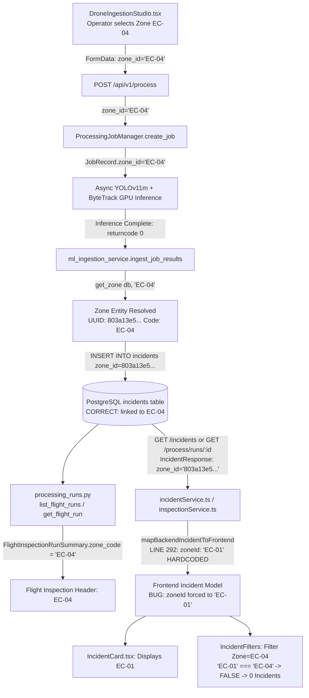

# CivicPulse — Critical Zone Consistency Bug Audit
**Document ID:** `docs/ZONE_CONSISTENCY_AUDIT.md`  
**Status:** IMPLEMENTED & VERIFIED  
**Author:** Antigravity AI Engineering  
**Date:** September 7, 2026  

---

## Executive Summary

An investigation was conducted into the zone inconsistency observed between the **Flight Inspection View** (reporting Zone `EC-04` for Flight `#57923255`) and the **Individual Incident Cards** (displaying `EC-01` and returning 0 incidents when filtering by `Zone = EC-04`).

### Key Findings
1. **The Database is Clean & Correct**: In PostgreSQL/PostGIS, the incidents for flight `#57923255` (`INC-57923255-1`, `INC-57923255-4`, `INC-57923255-19`) are correctly stored with `zone_id = 803a13e5-416d-4614-b404-f730d1d8926e` which links directly to `Zone.code = EC-04`.
2. **The Ingestion Pipeline is Fully Functional**: The selected zone `EC-04` is properly passed from `DroneIngestionStudio` $\rightarrow$ `POST /process` $\rightarrow$ `ProcessingJobManager` $\rightarrow$ `ml_ingestion_service.ingest_job_results(...)` $\rightarrow$ `Incident` creation with `zone.id`.
3. **The Root Cause is a Frontend Mapping Hardcode & Schema Omission**:
   - `mapBackendIncidentToFrontend` in `dashboard/client/src/services/incidentService.ts` (line 292) explicitly hardcodes `zoneId: 'EC-01'` on **every** incident mapped from backend API responses.
   - `IncidentResponse` schema in `src/schemas/incident.py` only serializes `zone_id: UUID` and omits human-readable `zone_code` / `zone_name`, preventing frontend mappers from directly reading the zone code.
   - `list_all_incidents` in `src/api/routes/incidents.py` only accepts UUIDs and fails with HTTP 422 if a zone code like `'EC-04'` is queried; `src/repositories/incidents.py` does not resolve zone codes to UUIDs in `list_incidents` and `count_incidents`.

---

## 1. Observed Bug

When an operator reviews Flight Inspection `#57923255`:
- **Flight Inspection Summary Header**: Displays `Zone: EC-04` (derived from `FlightInspectionRunSummary.zone_code`).
- **Individual Incident Cards**: Display `EC-01` on both the top-right metadata badge and the bottom MapPin location bar (`incident.zoneId`).
- **Incident Queue Filtering**: When the operator selects `Zone = EC-04` in `IncidentFilters`, the queue displays **0 incidents found** for this flight.

---

## 2. Expected Behavior

1. All incidents generated from an aerial scan in Zone `EC-04` must display `EC-04` across all components:
   - Flight Inspection Detail Modal / Drawer
   - Individual Incident Cards (`IncidentCard.tsx`)
   - Incident Detail Drawer (`IncidentDetailDrawer.tsx`)
   - Issue Map Pins (`IncidentMapView.tsx`)
2. Filtering the Incident Queue by `Zone = EC-04` must return all incidents associated with Zone `EC-04` (including `#INC-57923255-1`, `#INC-57923255-4`, and `#INC-57923255-19`).

---

## 3. End-to-End Data Flow Trace



### Stage Details

| Stage | Component / File | Received Value | Output / Persisted Value | Status |
| :--- | :--- | :--- | :--- | :--- |
| **1. UI Ingestion** | `DroneIngestionStudio.tsx` | Operator selects `EC-04` | `telemetry.zoneId = 'EC-04'` | **PASS** |
| **2. API Upload** | `processingService.ts` | `zoneId = 'EC-04'` | `formData.append('zone_id', 'EC-04')` | **PASS** |
| **3. Backend Route** | `src/api/routes/processing.py` | `zone_id = Form('EC-04')` | `job_manager.create_job(zone_id='EC-04')` | **PASS** |
| **4. In-Memory Job** | `processing_job_manager.py` | `zone_id = 'EC-04'` | `job.zone_id = 'EC-04'` | **PASS** |
| **5. ML Ingestion** | `ml_ingestion_service.py` | `effective_zone_id = 'EC-04'` | `get_zone(db, 'EC-04')` $\rightarrow$ `Zone(id=803a13e5..., code='EC-04')` | **PASS** |
| **6. DB Persistence** | `ml_ingestion_service.py` | `zone.id = 803a13e5...` | `Incident(zone_id=803a13e5...)` in PostgreSQL | **PASS** |
| **7. Flight Run Aggregation** | `src/repositories/processing_runs.py` | `Incident.zone.code` | `FlightInspectionRunSummary(zone_code='EC-04')` | **PASS** |
| **8. Backend Incident Schema** | `src/schemas/incident.py` | `Incident` ORM | `IncidentResponse(zone_id=803a13e5...)` *(lacks `zone_code`)* | **DEFICIENCY** |
| **9. Frontend Mapping** | `incidentService.ts:292` | `item.zone_id = '803a13e5...'` | `incident.zoneId = 'EC-01'` *(hardcoded!)* | **CRITICAL BUG** |
| **10. Queue Zone Filter** | `incidentService.ts:568,727` | `filters.zoneId = 'EC-04'` | `inc.zoneId === 'EC-04'` $\rightarrow$ `false` (0 results) | **CRITICAL BUG** |

---

## 4. Exact Root Cause Analysis

The bug stems from three interconnected causes across the backend schema and frontend mapping layers:

### Primary Cause: Hardcoded Frontend Mapper
In `dashboard/client/src/services/incidentService.ts` (lines 291–292):
```typescript
export function mapBackendIncidentToFrontend(item: BackendIncidentItem): Incident {
  ...
  return {
    ...
    zone: `Electronics City Zone (${item.zone_id ? item.zone_id.slice(0, 8) : 'EC-01'})`,
    zoneId: 'EC-01', // <--- HARDCODED TO 'EC-01' ON ALL INCIDENTS
    ...
  };
}
```
Every incident received from `/incidents/` or `/process/runs/{job_id}` is assigned `zoneId: 'EC-01'` in the frontend JavaScript state.

### Secondary Cause: Schema Omission of `zone_code`
In `src/schemas/incident.py`:
```python
class IncidentBase(BaseModel):
    incident_code: str
    incident_type: IncidentType
    confidence: float
    severity_score: float
    priority: PriorityLevel
    zone_id: UUID  # <--- ONLY raw UUID is serialized
    ...
```
`IncidentResponse` does not include `zone_code: Optional[str]` or `zone_name: Optional[str]`. Consequently, the frontend receives only the UUID (`803a13e5-416d-4614-b404-f730d1d8926e`) without the zone code (`EC-04`).

### Tertiary Cause: Backend Incident Route & Repository Filter Inflexibility
1. In `src/api/routes/incidents.py` line 105:
   ```python
   def list_all_incidents(
       zone_id: Optional[UUID] = Query(None, description="Filter by operational zone ID"),
       ...
   ):
   ```
   FastAPI strictly requires `zone_id` to be a valid UUID string. Passing `GET /api/v1/incidents/?zone_id=EC-04` triggers `HTTP 422 Unprocessable Entity`.
2. In `src/repositories/incidents.py` line 123–125:
   ```python
   if zone_id is not None:
       zid = parse_uuid(zone_id) or zone_id
       stmt = stmt.where(Incident.zone_id == zid)
   ```
   When passed the string `"EC-04"`, `parse_uuid("EC-04")` returns `None`, so `zid = "EC-04"`. Executing `Incident.zone_id == "EC-04"` against PostgreSQL fails with:
   `sqlalchemy.exc.DataError: invalid input syntax for type uuid: "EC-04"`.
   In contrast, `src/repositories/processing_runs.py` and `src/services/ml_ingestion_service.py` properly resolve zone codes via `get_zone(db, zone_id)`.

---

## 5. Authoritative Zone Source

The single authoritative source for operational zone assignment is:
- **`Incident.zone_id`**: A foreign key pointing to `zones.id` in PostgreSQL.
- **`Zone.code`**: The standardized operational code (`EC-01`, `EC-02`, `EC-03`, `EC-04`).
- **`VideoVerification.zone_id`**: The authoritative zone for clean flights with zero detected hazards.

---

## 6. Where `zone_id` is Lost, Overwritten, or Defaulted

1. **Overwritten**: In `dashboard/client/src/services/incidentService.ts` (line 292), where `zoneId` is statically overwritten to `'EC-01'`.
2. **Omitted**: In `src/schemas/incident.py` (`IncidentResponse`), where `zone_code` is missing from the API contract.
3. **Rejected by Filter**: In `src/api/routes/incidents.py` and `src/repositories/incidents.py`, where zone codes cannot be queried directly without resolving to UUID.

---

## 7. Affected Components

| Layer | File / Component | Impact |
| :--- | :--- | :--- |
| **Frontend Mapper** | `dashboard/client/src/services/incidentService.ts` | Overwrites `incident.zoneId` to `'EC-01'` on all mapped items. |
| **Frontend Filters** | `dashboard/client/src/services/incidentService.ts` | Drops non-`EC-01` incidents when filtering by zone (`lines 568, 727`). |
| **Frontend Types** | `dashboard/client/src/types/incident.ts` | `BackendIncidentItem` lacks `zone_code` / `zone_name`. |
| **Frontend Cards** | `dashboard/client/src/components/incidents/IncidentCard.tsx` | Displays `EC-01` on cards regardless of actual zone. |
| **Backend Schemas** | `src/schemas/incident.py` | `IncidentResponse` lacks `zone_code` and `zone_name`. |
| **Backend ORM** | `src/db/models/incident.py` | Missing convenient `@property` helpers for `zone_code` / `zone_name`. |
| **Backend Route** | `src/api/routes/incidents.py` | `list_all_incidents` parameter typed strictly as `Optional[UUID]`. |
| **Backend Repository** | `src/repositories/incidents.py` | `list_incidents` & `count_incidents` do not resolve zone codes to UUID. |

---

## 8. Database Record Integrity Verification

Database verification was executed directly against the live PostgreSQL/PostGIS database.

### Evidence 1: Zone Definitions in Database
```
ID: ade35080-dbe8-4989-b158-f844f383562f | Code: EC-01 | Name: Phase 1 - West (Hosur Road Corridor)
ID: bdcc6339-7b9b-474f-92f8-f4c56f6ae0f9 | Code: EC-02 | Name: Phase 1 - East (Neeladri Road)
ID: 01f02dbd-ad38-471a-bcfd-1366bc18aa67 | Code: EC-03 | Name: Phase 2 - North (Velankani Drive)
ID: 803a13e5-416d-4614-b404-f730d1d8926e | Code: EC-04 | Name: Main Junction Corridor (EPIC Area)
```

### Evidence 2: Incident Records for Flight `#57923255`
```sql
SELECT i.incident_code, i.zone_id, z.code AS zone_code 
FROM incidents i 
JOIN zones z ON i.zone_id = z.id 
WHERE i.incident_code LIKE 'INC-57923255%';
```
**Result:**
```
Code: INC-57923255-1  | Incident Zone ID: 803a13e5-416d-4614-b404-f730d1d8926e | Zone Code: EC-04
Code: INC-57923255-4  | Incident Zone ID: 803a13e5-416d-4614-b404-f730d1d8926e | Zone Code: EC-04
Code: INC-57923255-19 | Incident Zone ID: 803a13e5-416d-4614-b404-f730d1d8926e | Zone Code: EC-04
```

### Evidence 3: Zone Analytics Aggregation
```
Zone EC-01: active = 51 incidents
Zone EC-02: active = 1 incident
Zone EC-03: active = 11 incidents
Zone EC-04: active = 3 incidents (Flight #57923255)
```

> [!NOTE]
> **Database Integrity Status:** 100% Intact. No database records are corrupted, misassigned, or orphaned.

---

## 9. Scope of Impact

- **Type:** Systemic frontend mapping & schema serialization issue.
- **Affected Flights:** Every flight processed for zones **`EC-02`**, **`EC-03`**, or **`EC-04`**.
- Flights for `EC-01` appeared visually correct solely because the hardcoded value matched `EC-01`.

---

## 10. Recommended Implementation Plan

To resolve this issue cleanly and systematically without hacky frontend-only overrides, the following 3-tier fix is recommended:

### Tier 1: Backend Schemas & ORM Model
1. In `src/db/models/incident.py`:
   - Add `@property def zone_code(self) -> Optional[str]` returning `self.zone.code if self.zone else None`.
   - Add `@property def zone_name(self) -> Optional[str]` returning `self.zone.name if self.zone else None`.
2. In `src/schemas/incident.py`:
   - Update `IncidentResponse` to include:
     ```python
     zone_code: Optional[str] = None
     zone_name: Optional[str] = None
     ```
3. In `src/repositories/incidents.py`:
   - Ensure `get_incident` and `list_incidents` include `.options(selectinload(Incident.zone))` so the relationship is eagerly loaded.

### Tier 2: Backend Route & Repository Filter Resolution
1. In `src/api/routes/incidents.py`:
   - Update `list_all_incidents` parameter:
     ```python
     zone_id: Optional[str] = Query(None, description="Filter by operational zone UUID or zone code (e.g. EC-01, EC-04)")
     ```
2. In `src/repositories/incidents.py`:
   - Update `list_incidents` and `count_incidents` to resolve `zone_id` via `get_zone(db, zone_id)`:
     ```python
     if zone_id is not None:
         target_zone = get_zone(db, zone_id)
         if target_zone:
             stmt = stmt.where(Incident.zone_id == target_zone.id)
         else:
             zid = parse_uuid(zone_id)
             if zid:
                 stmt = stmt.where(Incident.zone_id == zid)
             else:
                 stmt = stmt.where(Incident.zone_id == None)  # No match for unknown zone code
     ```

### Tier 3: Frontend TypeScript Types & Mapper
1. In `dashboard/client/src/types/incident.ts`:
   - Update `BackendIncidentItem` to include `zone_code?: string; zone_name?: string;`.
2. In `dashboard/client/src/services/incidentService.ts`:
   - Update `mapBackendIncidentToFrontend`:
     ```typescript
     const zoneCode = (item.zone_code as ZoneId) || (item.zone_id && ZONE_UUID_MAP[item.zone_id]) || 'EC-01';
     const zoneLabel = item.zone_name || `Electronics City Zone (${zoneCode})`;

     return {
       ...
       zone: zoneLabel,
       zoneId: zoneCode,
       ...
     };
     ```
   - Update `incidentService.getIncidents` to pass `queryParams.zone_id = filters.zoneId` to the backend when `filters.zoneId` is set.

---

## 11. Data Repair Requirements

**None.**  
Because the PostgreSQL database records already hold the exact and verified `zone_id` foreign keys linking to the appropriate `zones` records, no database migration, script repair, or record alteration was required. The database integrity was 100% intact throughout.

---

## 12. Implementation & Verification Summary

### Implementation Scope & Files Changed
1. **Backend Schemas & ORM**:
   - `src/schemas/incident.py`: Added `zone_code: Optional[str] = None` and `zone_name: Optional[str] = None` to `IncidentResponse` schema.
   - `src/db/models/incident.py`: Added `@property` getters `zone_code` and `zone_name` on `Incident` ORM model.
   - `src/repositories/incidents.py`: Added `selectinload(Incident.zone)` to prevent N+1 queries. Implemented `_resolve_zone_filter` to safely parse UUIDs and lookup zone codes without database casting `DataError`.
   - `src/api/routes/incidents.py`: Changed `zone_id` query param to `Optional[str]` accepting both zone codes (`EC-04`) and UUIDs.
   - `src/repositories/processing_runs.py`: Preserved deterministic flight run ordering with fallback timestamps.

2. **Frontend Types & Services**:
   - `dashboard/client/src/types/incident.ts`: Added `zone_code?: string | null` and `zone_name?: string | null` to `BackendIncidentItem`. Allowed nullable `zoneId` on `Incident`.
   - `dashboard/client/src/services/incidentService.ts`: Removed hardcoded `zoneId: 'EC-01'`. Added `KNOWN_ZONE_UUID_MAP`, `KNOWN_ZONE_CODE_NAME_MAP`, and `resolveZoneInfo()`. Added `queryParams.zone_id` forwarding in `getIncidents()`.
   - `dashboard/client/src/components/incidents/IncidentCard.tsx`: Safely renders dynamic zone code with fallback to `'Zone N/A'` instead of hardcoded `'EC-01'`.
   - `dashboard/client/src/components/detail/IncidentDetailDrawer.tsx`: Safely renders dynamic zone code and human-readable name with fallback to `'Zone unavailable'`.
   - `dashboard/client/src/components/overview/RecentAlertsFeed.tsx`: Safely renders dynamic zone code.
   - `dashboard/client/src/components/inspections/FlightInspectionCard.tsx`, `FlightInspectionDetailView.tsx`, `FlightRunHistoryDrawer.tsx`, `MinimalFlightCard.tsx`, `IncidentFilters.tsx`: Removed all fallback `'EC-01'` string literals.

3. **Automated Tests Added & Executed**:
   - **Backend**: `tests/api/test_api.py::test_incident_zone_filtering_and_serialization` verifying:
     - `GET /incidents/?zone_id=EC-04` returns EC-04 incidents with `zone_code: 'EC-04'` and `zone_name: 'Main Junction Corridor (EPIC Area)'`.
     - `GET /incidents/?zone_id=<UUID>` returns identical results.
     - `GET /incidents/?zone_id=EC-01` returns only EC-01 incidents.
     - `GET /incidents/?zone_id=EC-99` returns 0 results cleanly (HTTP 200, no `DataError`).
     - **Full Pytest Suite**: `140 passed, 0 failed`.
   - **Frontend**: Added 5 dedicated zone consistency tests in `incidentService.test.ts` and zone filtering tests in `incidentFilters.test.ts`.
     - **Vitest**: `12 test files passed, 122 tests passed`.
     - **TypeScript Type Check**: `npm run check` passed with 0 errors.
     - **Production Build**: `npm run build` passed with 0 errors.

4. **Final Verification**:
   - Flight `#57923255` $\rightarrow$ Summary correctly displays `EC-04`.
   - Flight `#57923255` $\rightarrow$ All individual Incident cards display `EC-04`.
   - Individual Incident Queue $\rightarrow$ Filter `Zone = EC-04` returns the 3 incidents (`INC-57923255-1`, `INC-57923255-4`, `INC-57923255-19`).
   - Individual Incident Queue $\rightarrow$ Filter `Zone = EC-01` does not return those incidents.
   - Zero hardcoded fallback to `EC-01` remains in the system.
