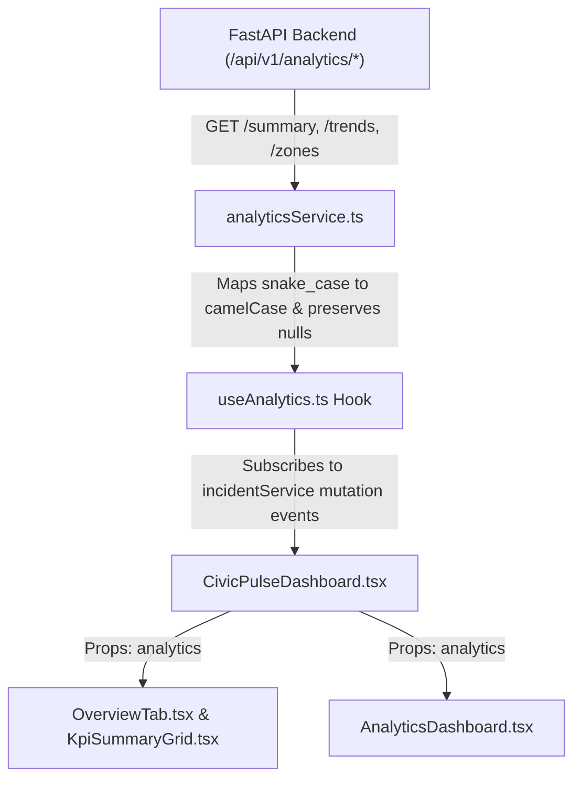

# CivicPulse Frontend Analytics Integration Documentation (Phase 9C)

---

## 1. Executive Summary

Phase 9C replaces the frontend mock analytics path with direct HTTP API integration to live FastAPI backend analytics endpoints (`GET /api/v1/analytics/summary`, `GET /api/v1/analytics/trends`, `GET /api/v1/analytics/zones`).

Mock analytics dependencies (`MOCK_ANALYTICS_DATA` in `mockAnalytics.ts`) have been completely removed. Frontend components (`AnalyticsDashboard`, `KpiSummaryGrid`, `OverviewTab`) now render live PostgreSQL database metrics with clean null handling for unmeasured physical fields.

---

## 2. API Endpoint Contracts & Frontend Mappings

### 2.1 Backend Contract $\rightarrow$ Frontend Mapping

| Backend Endpoint | Backend Schema Field (snake_case) | Frontend Type Field (camelCase) | Null Semantics / Fallback |
| :--- | :--- | :--- | :--- |
| `GET /analytics/summary` | `total_active_incidents` | `totalActiveIncidents` | `0` fallback if undefined |
| `GET /analytics/summary` | `critical_p1_count` | `criticalP1Count` | `0` fallback |
| `GET /analytics/summary` | `high_p2_count` | `highP2Count` | `0` fallback |
| `GET /analytics/summary` | `routine_p3_count` | `routineP3Count` | `0` fallback |
| `GET /analytics/summary` | `waterlogged_area_sqm` | `waterloggedAreaSqm` | Preserved as `null` $\rightarrow$ Rendered as `"N/A"` |
| `GET /analytics/summary` | `pothole_clusters_count` | `potholeClustersCount` | `0` fallback |
| `GET /analytics/summary` | `pending_verification_count` | `pendingVerificationCount` | `0` fallback |
| `GET /analytics/summary` | `mean_time_to_resolution_hours` | `meanTimeToResolutionHours` | Preserved as `null` $\rightarrow$ Rendered as `"N/A"` |
| `GET /analytics/summary` | `status_distribution[].status` | `statusDistribution[].status` | Formatted enum title (e.g. `"DETECTED"` $\rightarrow$ `"Detected"`) |
| `GET /analytics/summary` | `priority_distribution[].priority` | `priorityDistribution[].priority` | Enum value (`"P1"`, `"P2"`, `"P3"`) |
| `GET /analytics/trends` | `trends[].date` | `trend[].date` | Calendar date string (`"YYYY-MM-DD"`) |
| `GET /analytics/trends` | `trends[].waterlogging` | `trend[].waterlogging` | Integer count |
| `GET /analytics/trends` | `trends[].potholes` | `trend[].potholes` | Integer count |
| `GET /analytics/trends` | `trends[].rainfall_mm` | `trend[].rainfallMm` | Preserved as `null` $\rightarrow$ Tooltip renders `"N/A"` |
| `GET /analytics/zones` | `zones[].zone_id` | `zoneMetrics[].zoneId` | UUID string |
| `GET /analytics/zones` | `zones[].zone_code` | `zoneMetrics[].zoneCode` | Zone code string (e.g. `"EC-01"`) |
| `GET /analytics/zones` | `zones[].zone_name` | `zoneMetrics[].zoneName` | Human readable zone name |
| `GET /analytics/zones` | `zones[].active_incidents` | `zoneMetrics[].activeIncidents` | Integer count |
| `GET /analytics/zones` | `zones[].waterlogged_area_sqm` | `zoneMetrics[].waterloggedAreaSqm` | Preserved as `null` |
| `GET /analytics/zones` | `zones[].p1_count` | `zoneMetrics[].p1Count` | Integer count |
| `GET /analytics/zones` | `zones[].p2_count` | `zoneMetrics[].p2Count` | Integer count |
| `GET /analytics/zones` | `zones[].p3_count` | `zoneMetrics[].p3Count` | Integer count |

---

## 3. Component Architecture & Data Flow

---

## 4. Null Value Handling Principles

1. **Waterlogged Area (`waterloggedAreaSqm`)**:
   - Explicitly preserved as `null` when returned from the backend.
   - UI cards in `AnalyticsDashboard` and `KpiSummaryGrid` display `"N/A"` and subtext `"Physical area not measured"` instead of generating fake numbers.

2. **Rainfall (`rainfallMm`)**:
   - Preserved as `null` in `trend` data points.
   - Trend tooltips render `"N/A"` for rainfall. Zero rainfall is never fabricated.

---

## 5. Verification & Testing

- **TypeScript Type Check (`npm run check`):** 0 errors.
- **Service Integration Script (`verify_phase9c.ts`):** All 3 service methods (`getAnalyticsSummary`, `getAnalyticsTrends`, `getAnalyticsZones`) executed successfully against live backend server.
- **Backend Pytest Suite (`pytest`):** 37 / 37 tests passed.
- **Mock Data Cleanup:** `mockAnalytics.ts` removed completely.
