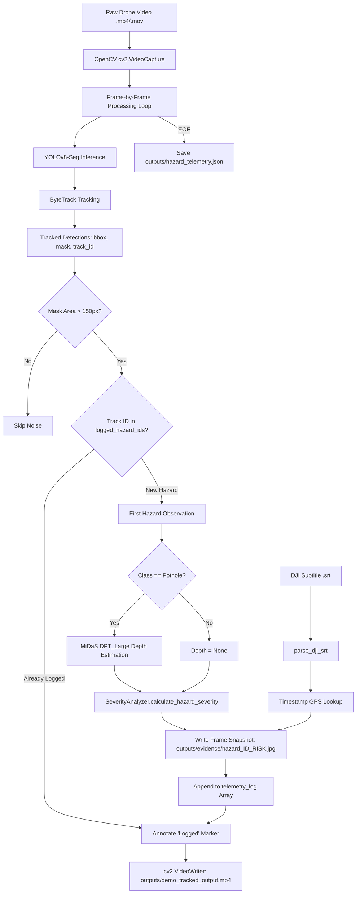
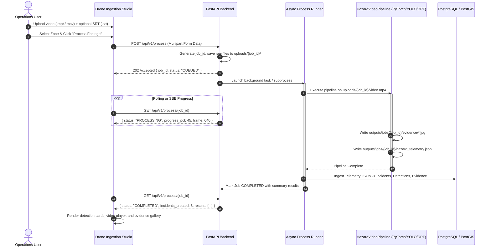
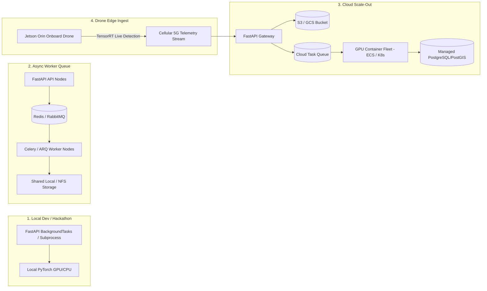

# CivicPulse ML & Dashboard Execution Path Audit

**Document Version**: 1.0.0  
**Audit Date**: August 26, 2026  
**Scope**: Ingestion Studio, ML Inference Pipeline, Database Ingestion, and Execution Architecture  
**Target Milestone**: Phase 11 Real ML Pipeline Integration  

---

## 1. Current Dashboard Ingest Flow

### 1.1 UI Component: `DroneIngestionStudio.tsx`
The primary user-facing interface for drone footage ingestion is located at `dashboard/client/src/components/ingestion/DroneIngestionStudio.tsx`.

#### Key UI Capabilities & User Journey:
1. **Preset Fast-Picker**:
   - Provides 5 one-click demo presets defined in `SAMPLE_PRESETS` (`waterlogging`, `pothole`, `drainage_overflow`, `damaged_footpath`, `clear`).
   - Selecting a preset populates the preview canvas with simulated SVG overlays and loads preset flight telemetry.
2. **Media Upload Flow**:
   - Contains a hidden file input `<input type="file" accept="image/*,video/*" />` triggered by a visual drag-and-drop surface or "Browse Files" button.
   - When a user uploads a file, `handleFileUpload` sets `mediaFile` and creates a browser blob object URL via `URL.createObjectURL(file)`.
   - The component sets `mediaType` to `'video'` if `file.type.startsWith('video')`, otherwise `'image'`.
3. **Flight Telemetry Form**:
   - Allows manual entry or preset loading of spatial and flight metadata:
     - **Surveillance Zone**: Select dropdown (`EC-01`, `EC-02`, `EC-03`, `EC-04`).
     - **Road / Junction Description**: Free-form text input (e.g. `Hosur Road Flyover Underpass`).
     - **Drone Swarm ID**: Text input (e.g. `DRONE-SWARM-ALPHA-1`).
     - **Flight Altitude**: Numeric input (in meters).
     - **Latitude & Longitude**: Decimal degrees step `0.0001`.
4. **Execution & Simulation**:
   - User clicks **"Run AI Drone Vision Analysis"** (`handleRunInference`).
   - Calls `inferenceService.analyzeMedia(...)`.
   - The UI displays an animated progress bar stepping through 5 simulated stages over ~1.8 seconds.
   - Upon completion, the UI displays the `InferenceResult` card:
     - Classification badge, confidence %, severity score ($0-10$), inundation area ($m^2$), lane obstruction ($0-10$), assigned zone, and recommended mitigation protocol.
     - Toggleable AI overlay switch over the canvas preview.
5. **Publishing to Live Operations Queue**:
   - User clicks **"Publish Incident to Operations Queue"** (`handlePublishIncident`).
   - Calls `inferenceService.publishAsIncident(inferenceResult)` which invokes `incidentService.createIncident(...)` (`POST /api/v1/incidents`), persisting the incident to the database.

---

## 2. Current Actual ML Flow

### 2.1 Pipeline Orchestrator: `HazardVideoPipeline` (`src/detection/video_tracker.py`)
The actual computer vision and depth estimation pipeline runs inside `src/detection/video_tracker.py` orchestrated by `HazardVideoPipeline`.



### 2.2 Execution Step Breakdown:
1. **Video & SRT Initialization**:
   - `cv2.VideoCapture` opens the input video stream.
   - `parse_dji_srt` extracts timestamped GPS coordinates (`lat`, `lon`, `time`).
2. **Model Loading**:
   - `YOLOSegmentor` loads custom weights (e.g. `runs/segment/civicpulse_4class_max-2/weights/best.pt` or `models/production/civicpulse_best.pt`).
   - `DepthEstimator` loads Intel DPT_Large via PyTorch Hub (CUDA/MPS/CPU).
   - `SeverityAnalyzer` initializes weighted metric calculation ($60\%$ depth, $40\%$ surface area).
3. **Frame Tracking & Noise Suppression**:
   - Each frame is tracked via `self.segmentor.track_frame(frame, persist=True)`.
   - Small detection artifacts below `min_area_pixels = 150` are filtered out.
4. **Hazard Deduplication & Snapshot Capture**:
   - In-memory set `self.logged_hazard_ids` tracks processed hazard IDs.
   - On the first frame a new hazard appears:
     - Depth calculation runs only for potholes (`cls_id == 1`).
     - Composite severity score ($0-100$) and risk level (`LOW`, `MODERATE`, `CRITICAL`) are computed.
     - Frame is saved to disk: `outputs/evidence/hazard_{track_id}_{risk_level}.jpg`.
     - Timestamp is matched to the closest DJI GPS coordinate.
     - Telemetry object is appended to `self.telemetry_log`.
5. **Output Generation**:
   - Annotated frames with polygon masks, bounding boxes, confidence tags, and "Logged" flags are written to `output_video_path`.
   - Final telemetry array is dumped to `outputs/hazard_telemetry.json`.

---

## 3. Input File Types

| Component | Accepted File Types | Telemetry Ingest | Current Status |
| :--- | :--- | :--- | :--- |
| **Frontend Dashboard** (`DroneIngestionStudio.tsx`) | `image/*` (`.jpg`, `.png`, `.webp`), `video/*` (`.mp4`, `.mov`) | Manual form fields (Zone, Lat/Lng, Drone ID, Altitude) | Simulated client inference |
| **ML Pipeline Script** (`scripts/run_pipeline.py`) | Video only (`.mp4`, `.mov`, `.avi`) | DJI SRT subtitle file (`.srt`) | Hardcoded local filesystem paths |
| **Core ML Engine** (`HazardVideoPipeline`) | Video path string (OpenCV compatible) | Optional `.srt` path string | Dynamic class initialization |

---

## 4. Pipeline CLI Contract

### 4.1 Current Implementation: `scripts/run_pipeline.py`
```python
def main():
    video_path = "data_raw/full_demo_video.mp4"
    pipeline = HazardVideoPipeline(
        weights_path="runs/segment/civicpulse_4class_max-2/weights/best.pt",
        output_dir="outputs",
        srt_path="data_raw/full_demo_video.srt"
    )
    pipeline.process_video(
        video_path=video_path,
        output_video_path="outputs/full_demo_tracked_output.mp4"
    )
```

### 4.2 CLI Audit Findings:
- **Argument Parsing**: None. Paths are hardcoded within the script body.
- **External Parametrization**: Arguments cannot currently be supplied via CLI flags (`argparse`/`click`).
- **Execution Model**: Fully synchronous and blocking. The script blocks the calling process until all video frames are decoded, inferred, and encoded.
- **Exit Codes**: Returns exit code `0` on successful completion; unhandled exceptions trigger exit code `1` with standard Python tracebacks.
- **Standard Streams**:
  - `stdout`: Prints operational logs (`[INFO]`, `[DRONE CAPTURE]`, `[COMPLETE]`).
  - `stderr`: PyTorch / Torch Hub / OpenCV backend warnings and download progress.

---

## 5. Pipeline Output Contract

When `HazardVideoPipeline.process_video()` executes, it generates three distinct artifacts in the target `output_dir`:

```
outputs/
├── demo_tracked_output.mp4          # Fully annotated output video with masks and track IDs
├── hazard_telemetry.json            # Consolidated JSON array of all unique detected hazards
└── evidence/                        # High-resolution JPEG frame snapshots
    ├── hazard_18_CRITICAL.jpg
    ├── hazard_34_CRITICAL.jpg
    ├── hazard_76_CRITICAL.jpg
    └── hazard_95_CRITICAL.jpg
```

---

## 6. Telemetry Contract

### 6.1 Telemetry JSON Schema (`outputs/hazard_telemetry.json`)
The telemetry JSON contains an array of serialized hazard records:

```json
[
  {
    "hazard_id": 18,
    "frame_logged": 624,
    "timestamp_sec": 21.52,
    "latitude": 22.308145,
    "longitude": 73.18162,
    "class_name": "waterlogging",
    "risk_level": "CRITICAL",
    "severity_score": 100,
    "relative_depth_drop": 0.0,
    "area_coverage_pct": 87.57,
    "mask_pixels": 453963.5,
    "evidence_file": "hazard_18_CRITICAL.jpg"
  }
]
```

### 6.2 Field Specifications:

| Field | Type | Description | Example |
| :--- | :--- | :--- | :--- |
| `hazard_id` | `int` | Unique ByteTrack identifier for the hazard track | `18` |
| `frame_logged` | `int` | Video frame index at time of first capture | `624` |
| `timestamp_sec` | `float` | Elapsed video timestamp in seconds | `21.52` |
| `latitude` | `float` \| `null` | Extracted GPS latitude from DJI SRT sync | `22.308145` |
| `longitude` | `float` \| `null` | Extracted GPS longitude from DJI SRT sync | `73.181620` |
| `class_name` | `string` | Detected class: `waterlogging`, `pothole`, `drainage_overflow`, `damaged_footpath` | `"waterlogging"` |
| `risk_level` | `string` | Categorical risk grade: `LOW`, `MODERATE`, `CRITICAL` | `"CRITICAL"` |
| `severity_score` | `int` | Composite multi-factor score ($0-100$) | `100` |
| `relative_depth_drop`| `float` | MiDaS estimated relative depth ($0.0$ for non-potholes) | `0.0` |
| `area_coverage_pct` | `float` | Hazard mask area as % of total video frame area | `87.57` |
| `mask_pixels` | `float` | Total pixel count within segmentation polygon | `453963.5` |
| `evidence_file` | `string` | Relative filename in evidence folder | `"hazard_18_CRITICAL.jpg"` |

---

## 7. Evidence Contract

### 7.1 Asset Storage & Naming
- Evidence files are written to disk as JPEG images: `outputs/evidence/hazard_{hazard_id}_{risk_level}.jpg`.
- Resolution matches the native video source resolution (e.g. $1920 \times 1080$ or $3840 \times 2160$).

### 7.2 Web Serving & Frontend Resolution
1. **FastAPI Static Mount**:
   - `src/api/main.py` mounts `settings.EVIDENCE_DIR` (`outputs/evidence`) to `/static/evidence` and `/evidence`.
2. **Database Record**:
   - Stored in the `evidence` table with `file_path = "outputs/evidence/hazard_18_CRITICAL.jpg"`.
3. **Frontend Client Resolution**:
   - `incidentService.getEvidenceMediaUrl(path)` extracts the clean filename and maps it to `http://127.0.0.1:8000/static/evidence/hazard_18_CRITICAL.jpg`.

---

## 8. Current Gap Between Dashboard and Real Pipeline

| Dimension | Current Dashboard (Frontend) | Actual ML Pipeline (Backend) | Integration Gap |
| :--- | :--- | :--- | :--- |
| **Inference Trigger** | Client-side timer simulation (`setTimeout`) in `inferenceService.ts` | Standalone Python execution `scripts/run_pipeline.py` | No REST API or WebSocket connects frontend button to backend pipeline |
| **File Upload** | Browser blob URL in memory (`URL.createObjectURL`) | Reads static file from disk (`data_raw/full_demo_video.mp4`) | No multipart upload endpoint to transmit video and SRT files |
| **Telemetry Source** | Mock form values / preset JSON | DJI `.srt` subtitle parser (`parse_dji_srt`) | Dashboard does not accept or parse `.srt` files |
| **Output Consumption** | Synthetic SVG data URIs generated in browser | Real OpenCV `.mp4`, `.json`, and `.jpg` in `outputs/` | Real outputs are not streamed or returned to the UI after processing |
| **Database Persistence** | Manual 1-by-1 incident creation from simulated result | Offline batch seeding script (`seed_database.py`) | No automated PostGIS ingestion hook upon video processing completion |

---

## 9. Recommended Integration Architecture

To bridge the gap cleanly without blocking FastAPI or freezing browser sessions, a **Decoupled Asynchronous Job Pipeline** is recommended:



---

## 10. Proposed APIs

### 10.1 `POST /api/v1/process`
Initiates an asynchronous ML video processing job.

#### Request (Multipart Form Data):
- `video`: Binary File (`.mp4`, `.mov`, `.avi`) — *Required*
- `srt`: Binary File (`.srt`) — *Optional*
- `zone_id`: String UUID or code (e.g. `"EC-01"`) — *Optional, default fallback*
- `drone_id`: String (e.g. `"DRONE-SWARM-ALPHA-1"`) — *Optional*
- `conf_threshold`: Float (e.g. `0.20`) — *Optional*

#### Response (`202 Accepted`):
```json
{
  "job_id": "7c9e6679-7425-40de-944b-e07fc1f90ae7",
  "status": "QUEUED",
  "message": "Drone footage uploaded successfully. Video processing pipeline queued.",
  "created_at": "2026-08-26T12:35:00.000Z",
  "estimated_duration_sec": 45
}
```

---

### 10.2 `GET /api/v1/process/{job_id}`
Retrieves execution status, live progress, and final detection telemetry.

#### Response (`200 OK` - In Progress):
```json
{
  "job_id": "7c9e6679-7425-40de-944b-e07fc1f90ae7",
  "status": "PROCESSING",
  "progress_pct": 68.5,
  "current_stage": "Frame 1420/2072: YOLOv8 Segmentation & Depth Estimation",
  "hazards_detected": 6,
  "created_at": "2026-08-26T12:35:00.000Z",
  "completed_at": null,
  "error": null,
  "results": null
}
```

#### Response (`200 OK` - Completed):
```json
{
  "job_id": "7c9e6679-7425-40de-944b-e07fc1f90ae7",
  "status": "COMPLETED",
  "progress_pct": 100.0,
  "current_stage": "Database ingestion complete. Incidents published.",
  "hazards_detected": 8,
  "created_at": "2026-08-26T12:35:00.000Z",
  "completed_at": "2026-08-26T12:35:42.120Z",
  "error": null,
  "results": {
    "summary": {
      "total_incidents": 8,
      "waterlogging": 4,
      "pothole": 2,
      "drainage_overflow": 1,
      "damaged_footpath": 1
    },
    "incident_ids": [
      "INC-AI-18",
      "INC-AI-34",
      "INC-AI-76",
      "INC-AI-95"
    ],
    "output_video_path": "outputs/jobs/7c9e6679/annotated_output.mp4",
    "output_video_url": "/static/evidence/jobs/7c9e6679/annotated_output.mp4",
    "telemetry_file": "outputs/jobs/7c9e6679/hazard_telemetry.json",
    "evidence_count": 8
  }
}
```

---

## 11. Windows Local Development Strategy

Running deep learning pipelines on Windows local environments requires specific process and thread isolation safeguards:

1. **Subprocess Isolation over Threading**:
   - Avoid running `cv2.VideoCapture` and PyTorch inference inside FastAPI's async event loop thread. OpenCV and CUDA calls hold the GIL and freeze HTTP request handling.
   - Use Python's `asyncio.create_subprocess_exec` executing via `sys.executable` (pointing directly to `.venv\Scripts\python.exe`):
     ```python
     cmd = [
         sys.executable,
         "-m", "src.detection.runner",
         "--video", upload_video_path,
         "--srt", upload_srt_path,
         "--output-dir", job_output_dir,
         "--job-id", job_id
     ]
     proc = await asyncio.create_subprocess_exec(
         *cmd,
         stdout=asyncio.subprocess.PIPE,
         stderr=asyncio.subprocess.PIPE
     )
     ```
2. **Non-blocking Progress Streaming**:
   - The CLI runner prints structured progress tokens (e.g. `[PROGRESS: 45.2]`).
   - The async background reader reads lines asynchronously without deadlock:
     ```python
     async for line in proc.stdout:
         decode_line = line.decode().strip()
         if "[PROGRESS:" in decode_line:
             update_job_progress(job_id, parse_pct(decode_line))
     ```
3. **Dedicated Job Workspace Folders**:
   - Each job receives an isolated directory:
     - `uploads/{job_id}/input.mp4`
     - `uploads/{job_id}/telemetry.srt`
     - `outputs/jobs/{job_id}/evidence/`
   - Prevents file locking collisions (`PermissionError` common on Windows when files are accessed concurrently).

---

## 12. Production Strategy

The architecture is designed to scale across deployment stages without changing API contracts:



1. **Stage 1 (Local Dev)**: FastAPI asynchronous subprocess executing against local PyTorch virtual environment.
2. **Stage 2 (Celery / Redis Worker)**: FastAPI enqueues `job_id` into Redis; dedicated worker processes handle video decoding and GPU batching.
3. **Stage 3 (Cloud GPU Containers)**: Workers run inside autoscaling Docker containers with NVIDIA Container Toolkit; video and evidence assets store in AWS S3 or Google Cloud Storage.
4. **Stage 4 (Edge Inference on Drone)**: High-speed TensorRT models run directly onboard edge hardware (NVIDIA Jetson Orin), streaming JSON telemetry and cropped evidence snapshots to the API over 4G/5G.

---

## 13. Risks & Mitigations

### 13.1 Multiple Simultaneous Uploads
- **Risk**: Multiple concurrent video jobs can exhaust system RAM and crash the server.
- **Mitigation**: Implement a local execution semaphore (`asyncio.Semaphore(1)` for single-GPU setups) to queue subsequent jobs while one runs.

### 13.2 GPU VRAM Contention
- **Risk**: Concurrent PyTorch CUDA contexts (YOLOv8 + DPT_Large) will cause `CUDA out of memory` errors.
- **Mitigation**: Enforce single-process GPU execution queue and call `torch.cuda.empty_cache()` between jobs.

### 13.3 Long-Running Processes & Timeouts
- **Risk**: Standard HTTP requests will timeout if waiting for 2-minute videos.
- **Mitigation**: Return immediate `202 Accepted` with a `job_id`, using polling or Server-Sent Events (SSE) for progress.

### 13.4 Process Crashes & Zombie Jobs
- **Risk**: An unexpected OpenCV crash leaves jobs stuck in `PROCESSING` forever.
- **Mitigation**: Wrap subprocess in `try...except...finally`, record process exit codes, and set a hard job timeout (e.g. 5 minutes).

### 13.5 Output File Collisions
- **Risk**: Writing to a shared `outputs/hazard_telemetry.json` overwrites previous run outputs.
- **Mitigation**: Use strictly scoped directories: `outputs/jobs/{job_id}/`.

### 13.6 Malicious Uploads & File Size Limits
- **Risk**: Oversized video files or executable payloads masquerading as videos.
- **Mitigation**: Enforce maximum file size (e.g. 200MB), validate magic bytes/headers with `ffprobe` / `cv2.VideoCapture`, and reject non-video files.

### 13.7 Stale Jobs on Server Restart
- **Risk**: Backend restart leaves database jobs in `PROCESSING` status.
- **Mitigation**: Add a startup reconciliation hook in `lifespan` that transitions orphaned `PROCESSING` jobs to `FAILED`.

---

## 14. Recommended Next Step: Phase 11 Implementation Roadmap

To connect the real ML pipeline to the dashboard with zero architectural regression, Phase 11 should be implemented in four focused steps:

1. **Step 1: Modular Pipeline Runner & CLI**
   - Refactor `src/detection/video_tracker.py` to accept dynamic output directories and progress callback hooks.
   - Create a clean CLI wrapper `src/detection/runner.py` with `argparse` support (`--video`, `--srt`, `--output-dir`, `--job-id`).

2. **Step 2: FastAPI Processing Router & Job Manager**
   - Create `src/api/routes/processing.py` providing `POST /api/v1/process` and `GET /api/v1/process/{job_id}`.
   - Implement an in-memory / database-backed Job Manager with async process execution and output directory isolation.

3. **Step 3: Automated PostGIS Database Ingestion Hook**
   - Build an automated ingestion service that reads `hazard_telemetry.json` upon pipeline exit.
   - Ingest hazards directly as `Incident`, `Detection`, and `Evidence` entities in PostgreSQL/PostGIS.

4. **Step 4: Frontend Dashboard Integration**
   - Update `DroneIngestionStudio.tsx` to add optional `.srt` file upload.
   - Replace the simulated `setTimeout` in `inferenceService.ts` with real `POST /api/v1/process` and progress polling against `GET /api/v1/process/{job_id}`.
   - Automatically redirect or populate live incidents upon completion.
